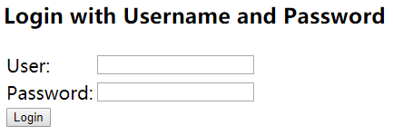

# 初识Spring Security
在本次【Web系统前后端分离架构】实战项目中，后端使用的是Java，使用的安全框架是**Spring Security**。

在gradle的配置文件里导入以下包依赖：
```groove
compile('org.springframework.boot:spring-boot-starter-security')
```
> 我使用的SpringBoot的版本是2.0.5.RELEASE，所以starter自动导入的是5.0.8版本的Spring Security。不同版本可能有细微差别。

至此，系统就默认集成了Spring Security。从`main`方法启动引用，可以看到控制台打印了一个随机生成的密码：

```log
ded1699e-d06f-4578-b500-0d3b9055174f
```

这个时候访问localhost:8080，可以看到如下页面：

<center>


这里的用户名是"user"，密码是刚才上面提到的在启动时打印出来的。输入后就可以登录进应用了。